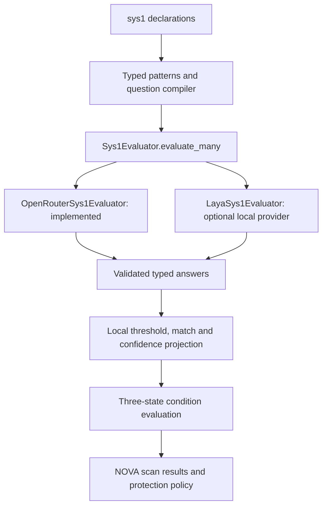

# Laya source review and System 1 integration

Reviewed 22 September 2026. Status: implemented on the local development branch. OpenRouter and optional
local Laya share the System 1 contract. The source assessment below predates
implementation; integration tests are not an independent quality benchmark.
See the [usage and validation guide](../sys1.md#local-laya-provider).

## Assessment

Laya is a credible candidate for optional local typed inference. Its interface
matches NOVA's Noul, Choice and Score declarations closely. Evaluate it as another
provider, with its own operating limits and measured quality. The article does
not establish that it can replace Jev across NOVA workloads.

The repository's [benchmark report](https://github.com/NandhaKishorM/laya/blob/main/BENCHMARKS.md)
explicitly says the Jev comparison uses different prompts and samples. The 0.766
typed-decisions accuracy uses fine-tuning; base checkpoints score about 0.35.
The headline 0.081 calibration error follows temperature fitting. Raw typed-model
ECE is 0.213 versus the cited Jev result of 0.144. Local GPU latency and remote
API latency are different measurements, and serial requests are not equivalent
to NOVA's mixed batch. These results support testing, not a general superiority
claim. Dataset presence in a training mix is not, by itself, evidence of test leakage.

The article's stronger claims also need qualification:

- Fixed output heads constrain the answer format; they do not eliminate wrong
  classifications, invalid numeric values, runtime failures or misleading confidence.
- No API fee does not mean no cost: serving needs compute, memory and operations.
- Language coverage and exceeding a low random baseline do not establish usable
  accuracy for each deployment language.
- A teacher's self-agreement is not a mathematical ceiling on accuracy against
  independently labelled ground truth.

The priority dispute is not established by these sources. The
[March 2025 paper](https://arxiv.org/abs/2503.23303) concerns sales-conversion
trajectories using sequence representations and reinforcement learning. The
[September 2025 paper](https://arxiv.org/abs/2510.01237) concerns confidence-aware
routing to mitigate hallucination. That second citation does not substantiate
the article's description of a formalization of the same general typed RL
decision engine. Related earlier research does not establish identical systems
or copying, and that dispute does not determine NOVA's integration design.

## Reviewed implementation

[PyPI lists Laya 0.3.5](https://pypi.org/project/laya/), newer than the article's
0.3.3 example. Its publication provenance points to commit
`573e5b62696ba441230cd6be71d593331b5d23af`. The following inference and sequence
contracts were checked at that commit; routing and packaging were also reviewed
on the repository's current main branch. Freeze all source and weight revisions
again when implementing the adapter.

The pinned [agent implementation](https://github.com/NandhaKishorM/laya/blob/573e5b62696ba441230cd6be71d593331b5d23af/laya/agent.py)
accepts a question map, builds one sequence per question and runs a batched
forward pass. It repeats the state in those sequences; this is not one shared
state encoding. Answers expose the native primitives, with four-decimal
probabilities. The returned model name is generic, so deployment diagnostics
need the checkpoint identity separately. Loading or inference can fall back to
CPU, which requires an explicit NOVA policy rather than an assumed GPU latency.

The pinned [sequence builder and confidence function](https://github.com/NandhaKishorM/laya/blob/573e5b62696ba441230cd6be71d593331b5d23af/laya/common.py)
silently truncate criterion tokens, question instructions and state. Choice and
Score confidence is normalized entropy, `1 - H(p) / log(k)`, not the probability
that the selected answer is correct. These are important adapter constraints.

The [router](https://github.com/NandhaKishorM/laya/blob/main/laya/router.py)
supports explicit model/task/language selection, language heuristics and optional
workflow detection. NOVA's opaque question IDs should not determine which model
is used. Begin with an explicitly selected checkpoint; add language routing only
as a separate, observable configuration choice.

## Fit within NOVA

Keep the existing keywords → semantics → System 1 → LLM scheduling, short-circuit
behavior and scan-local batching. Laya is implemented in `nova/evaluators/sys1/laya.py`;
it does not replace the semantic similarity evaluator. No new rule syntax or
arbitrary result attributes are needed.

| Existing boundary | Laya behavior |
|---|---|
| `Sys1Evaluator.evaluate_many(patterns, state)` | One applicable mixed question batch per rule |
| Question compiler in `projection.py` | Reuse `type`, `instructions`, `criteria`; keep rule settings local |
| Noul criteria | Send both authored true and false descriptions |
| Choice / Score | Preserve category keys / ordered level positions |
| Explicit state envelope | Use the same text and caller context as OpenRouter |
| Answer validation | Normalize Laya output and validate against each requested pattern |
| Predicate conversion | Reuse thresholds, membership and UNKNOWN for required missing/low confidence |
| SDK protection | Required unavailable or invalid inference prevents invocation |
| Results | Retain matches, nonmatches, native values, model identity and failure reasons |

## Implemented decisions

- A shared factory constructs lazy adapters across matcher, scanner and SDK.
- The isolated `[laya]` extra pins SDK 0.3.5 and retains NOVA's Transformers floor.
- `nova-sys1 prepare-laya` explicitly downloads one revision-pinned checkpoint,
  prepares its tokenizer and writes a standalone checksummed snapshot.
- Scans require complete local assets. One model is reused per detector with
  serialized loading/inference; CPU is default and CUDA must be explicit.
- Token-exact preflight prevents the SDK from truncating questions, criteria or
  state. Special mask-token text is rejected rather than silently rewritten.
- Four-decimal answer validation is separate from OpenRouter rounding tolerance.
- Existing conditions, UNKNOWN semantics and protection behavior are reused.
- Diagnostics preserve checkpoint, device, applied calibration and available usage.
- In-process queue waits are bounded; active inference cannot be forcibly cancelled.

No automatic routing, provider fallback, implicit downloads, fine-tuning,
calibration fitting or Apple GPU support is included. CPU validation does not
establish CUDA compatibility. See the guide for the offline suite, opt-in local
smoke tests and labelled provider-comparison harness.
