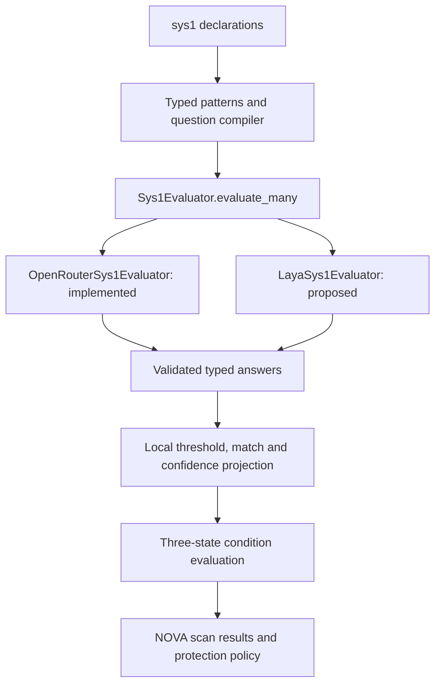

# Laya source review and System 1 integration proposal

Reviewed 22 September 2026. Status: architecture proposal, not an implemented
provider. The `sys1` rename is implemented; OpenRouter remains the only built-in
System 1 provider. No Laya dependency or model weights were installed for this
review, and no inference or independent benchmark was run.

## Assessment

Laya is a credible candidate for optional local typed inference. Its interface
matches NOVA's Noul, Choice and Score declarations closely. Evaluate it as another
provider, with its own operating limits and measured quality. The article does
not establish that it can replace Jev across NOVA workloads.

The repository's [benchmark report](https://github.com/NandhaKishorM/laya/blob/main/BENCHMARKS.md)
explicitly says the Jev comparison uses different prompts and samples. The 0.766
typed-decisions accuracy uses fine-tuning; base checkpoints score about 0.35.
The headline 0.081 calibration error follows temperature fitting. Raw typed-model
ECE is 0.213 versus the cited Jev result of 0.144. Local GPU latency and remote
API latency are different measurements, and serial requests are not equivalent
to NOVA's mixed batch. These results support testing, not a general superiority
claim. Dataset presence in a training mix is not, by itself, evidence of test leakage.

The article's stronger claims also need qualification:

- Fixed output heads constrain the answer format; they do not eliminate wrong
  classifications, invalid numeric values, runtime failures or misleading confidence.
- No API fee does not mean no cost: serving needs compute, memory and operations.
- Language coverage and exceeding a low random baseline do not establish usable
  accuracy for each deployment language.
- A teacher's self-agreement is not a mathematical ceiling on accuracy against
  independently labelled ground truth.

The priority dispute is not established by these sources. The
[March 2025 paper](https://arxiv.org/abs/2503.23303) concerns sales-conversion
trajectories using sequence representations and reinforcement learning. The
[September 2025 paper](https://arxiv.org/abs/2510.01237) concerns confidence-aware
routing to mitigate hallucination. That second citation does not substantiate
the article's description of a formalization of the same general typed RL
decision engine. Related earlier research does not establish identical systems
or copying, and that dispute does not determine NOVA's integration design.

## Reviewed implementation

[PyPI lists Laya 0.3.5](https://pypi.org/project/laya/), newer than the article's
0.3.3 example. Its publication provenance points to commit
`573e5b62696ba441230cd6be71d593331b5d23af`. The following inference and sequence
contracts were checked at that commit; routing and packaging were also reviewed
on the repository's current main branch. Freeze all source and weight revisions
again when implementing the adapter.

The pinned [agent implementation](https://github.com/NandhaKishorM/laya/blob/573e5b62696ba441230cd6be71d593331b5d23af/laya/agent.py)
accepts a question map, builds one sequence per question and runs a batched
forward pass. It repeats the state in those sequences; this is not one shared
state encoding. Answers expose the native primitives, with four-decimal
probabilities. The returned model name is generic, so deployment diagnostics
need the checkpoint identity separately. Loading or inference can fall back to
CPU, which requires an explicit NOVA policy rather than an assumed GPU latency.

The pinned [sequence builder and confidence function](https://github.com/NandhaKishorM/laya/blob/573e5b62696ba441230cd6be71d593331b5d23af/laya/common.py)
silently truncate criterion tokens, question instructions and state. Choice and
Score confidence is normalized entropy, `1 - H(p) / log(k)`, not the probability
that the selected answer is correct. These are important adapter constraints.

The [router](https://github.com/NandhaKishorM/laya/blob/main/laya/router.py)
supports explicit model/task/language selection, language heuristics and optional
workflow detection. NOVA's opaque question IDs should not determine which model
is used. Begin with an explicitly selected checkpoint; add language routing only
as a separate, observable configuration choice.

## Fit within NOVA

Keep the existing keywords → semantics → System 1 → LLM scheduling, short-circuit
behavior and scan-local batching. Laya belongs in `nova/evaluators/sys1/laya.py`;
it does not replace the semantic similarity evaluator. No new rule syntax or
arbitrary result attributes are needed.

| Existing boundary | Proposed Laya behavior |
|---|---|
| `Sys1Evaluator.evaluate_many(patterns, state)` | One applicable mixed question batch per rule |
| Question compiler in `projection.py` | Reuse `type`, `instructions`, `criteria`; keep rule settings local |
| Noul criteria | Send both authored true and false descriptions |
| Choice / Score | Preserve category keys / ordered level positions |
| Explicit state envelope | Use the same text and caller context as OpenRouter |
| Answer validation | Normalize Laya output and validate against each requested pattern |
| Predicate conversion | Reuse thresholds, membership and UNKNOWN for required missing/low confidence |
| SDK protection | Required unavailable or invalid inference prevents invocation |
| Results | Retain matches, nonmatches, native values, model identity and failure reasons |

## Implementation sequence

1. **Provider construction and optional dependencies.** Add one shared factory
   used by matcher, scanner and SDK. Select the adapter from `Sys1Config.provider`.
   Add an optional `laya` installation extra with a tested package/dependency
   combination; base imports must not load Torch or Transformers. Respect NOVA's
   dependency security floors rather than accepting every upstream minimum.
   The current [Laya package metadata](https://github.com/NandhaKishorM/laya/blob/main/pyproject.toml)
   requires Python 3.10+ and an ML runtime including Torch, Transformers,
   safetensors, huggingface-hub and NumPy.

2. **Explicit model lifecycle.** Configure the checkpoint, revision, device and
   calibration profile independently of rule syntax. Provision a complete pinned
   local snapshot, including tokenizer and encoder assets, before scanning.
   Do not implicitly download weights on the first protected action. Start with
   one preloaded checkpoint and serialized inference. No automatic model switch
   or remote fallback. If device fallback is permitted, expose the actual device;
   otherwise reject it. Optional routing comes later and records the selected
   checkpoint and route reason.

3. **Reject truncation before inference.** Preflight every compiled question using
   the exact pinned tokenizer and sequence layout. Reject any loss of instructions,
   option descriptions or state, including the full NOVA context envelope. A byte
   limit alone is insufficient. Return a typed `input_too_long` diagnostic, not a
   prediction from truncated content. Do not silently summarize or discard history.

4. **Provider-specific validation.** Make numeric precision an explicit validation
   parameter: OpenRouter currently has a two-decimal rounding allowance, whereas
   Laya returns four decimals. Do not inherit the looser allowance accidentally.
   Validate requested IDs, primitive types, finite values, category membership,
   probability normalization, score range and legend consistency. Extra provider
   confidence on Noul does not introduce a Noul `min_confidence` setting.
   Provider action-head outputs must never bypass NOVA's authored condition.

5. **Confidence and calibration.** Preserve the reported confidence separately
   from class probabilities. Do not reuse Jev confidence thresholds without
   validation on representative inputs. Record checkpoint and calibration-profile
   versions, and evaluate the actual deployed temperature settings. Fit calibration
   on data separate from final quality tests. Calibration on one distribution does
   not guarantee correctness under distribution shift or prompt manipulation.

6. **Execution limits and diagnostics.** Bound payload size, batch size and queued
   work. Start with one inference at a time because model/device lifecycle is
   mutable. A Python thread timeout cannot cancel a running Torch kernel; use an
   isolated worker if a hard inference deadline is required. Distinguish load,
   token-limit, resource, inference and confidence failures. Preserve actual
   checkpoint/revision/device and available usage; do not invent request IDs,
   dollar costs or provider reasoning. Default logs must omit raw context.

These are proposed additions. `provider=laya`, checkpoint/device settings and a
Laya installation extra are **not currently supported**. Existing configuration
continues to select OpenRouter explicitly; the model ID stays `typesafe/jev-1.13`.

## Acceptance gates

- Offline adapter fixtures for mixed primitives, reordered/missing answers,
  invalid numbers, confidence requirements and provider precision.
- No inference for settled conditions; one batch for applicable questions;
  sync, async, scanner and decorator paths agree.
- Every token boundary rejects overflow without truncation, including long
  questions, criteria, multilingual text and structured history.
- Required failures remain UNKNOWN and cannot execute a protected action.
  Concurrent scans cannot exchange state or diagnostics.
- Legacy imports and scans work without Laya or its ML dependencies. Test the
  supported Python versions and installation extras separately.
- Opt-in local inference tests with a pinned snapshot and synthetic inputs;
  default CI never downloads weights or calls a live provider.
- A labelled comparison using identical NOVA states, questions and evaluation
  splits. Include authorized sensitive actions, harmless deviations, quoted
  attacks, missing context and the same action under different approved goals.
- Report false positives, misses, abstentions, calibration, cold/warm latency,
  batch size, truncation rejection rate, peak memory and serving cost on the
  actual deployment hardware. Evaluate languages separately and exclude future
  events from prevention tests.

Recommend enabling Laya only for workloads that pass these gates. The benefit to
test is local, controllable inference; the DSL and enforcement remain NOVA's.
